# Online TIA — Admin & Operations Guide

Working protocol for the **Online Technical Infrastructure Assessment (TIA)** service:
how a customer request flows from the online form to a finished report, and how an admin
operates and troubleshoots the automated agent behind it.

For deployment/setup, the full configuration reference, and the exhaustive troubleshooting
list, see [README.md](README.md). This guide is the day-to-day operational companion.

## End-to-end flow

```mermaid
flowchart LR
    C["Customer<br/>fills Microsoft Form"] --> F["Microsoft Forms"]
    F --> PA["Power Automate<br/>sends confirmation email +<br/>writes response as JSON"]
    PA --> SP[("SharePoint library")]
    SP -->|OneDrive sync| IN["InputCustomerResponse<br/>(agent working folder)"]
    IN --> AG["Agent (run.py)<br/>hourly — generates report"]
    AG --> OUT["OutputReport<br/>.md + .docx"]
    OUT --> CON["Blue Prism consultant<br/>reviews / edits the .docx"]
    CON --> C2["Customer<br/>receives report within a week"]
```



The agent's responsibility is the middle of this chain only: it starts when a JSON lands
in `InputCustomerResponse` and ends when a report is written to `OutputReport`. The
confirmation email and the JSON export are handled by Power Automate (the form itself is
Microsoft Forms), and sending the finished report is the consultant's manual step — all
outside the agent.

## Customer's point of view

1. Go to **https://forms.office.com/r/J9yBcDpfy9** and fill in the form.
2. Within seconds of submitting, receive a **confirmation email** containing a summary of
   the questions and answers. *(This email is sent by Power Automate, not by the agent.)*
3. Receive the **Online TIA report from a Blue Prism consultant within a week**.

## Admin's point of view

### Where the data lives

All input and output data lives in a SharePoint document library:

> https://ssctechnologiesinc.sharepoint.com/teams/BPM-ProfessionalServices/Shared%20Documents/Forms/Document%20Names.aspx?id=%2Fteams%2FBPM%2DProfessionalServices%2FShared%20Documents%2FTeam%20Documents%2FPortfolio%2FOnlineTIA%2FAutomation&sortField=Modified&isAscending=false&viewid=e305230c%2D633b%2D44e9%2Db07f%2Dfff94774adaa

That library is synchronised to the agent machine through **OneDrive**, where it appears as
the local folder tree under `C:\blueprism\OnlineTIAWorkingDir` that the agent reads and
writes. So a JSON that Power Automate saves into the library appears in the local
`InputCustomerResponse` folder for the agent to pick up, and reports the agent writes
locally sync back up to the library.

### How submissions arrive

A **Power Automate** flow turns each form submission into a JSON file that arrives in
**`InputCustomerResponse`** — one JSON file per customer response. No manual step is needed
for normal intake.

### The agent and its schedule

The agent (`run.py`) is scheduled via Windows Task Scheduler to run **once every hour, 12
times a day — from 2:00 AM to 2:00 PM US Eastern (GMT−5), 7 days a week**. Each run
processes every pending file it finds; when the inbox is empty, the run is a fast no-op.
Submissions that arrive outside that window are picked up on the next scheduled run.

### Customer-file lifecycle

Each customer JSON moves through three folders as the agent handles it:

| Folder | Meaning |
|--------|---------|
| `InputCustomerResponse` | Waiting to be processed (as delivered by Power Automate). |
| `Processing` | The agent is currently working on this file. |
| `Processed` | The agent has finished; a report was generated. |

A file that is still in **`Processing`** after a run finished did **not** complete (for
example the gateway was unreachable). It is retried automatically on the next hourly run —
see *Troubleshooting* below.

### Reports

Generated reports land in **`OutputReport`** as a matching pair:

- `TIA_<BookingID>_<timestamp>.md` — the Markdown source.
- `TIA_<BookingID>_<timestamp>.docx` — the **editable Word copy** the consultant works from.

Reports are **AI-generated drafts**, grounded in the reference material. A Blue Prism
consultant reviews/edits the `.docx` and sends it to the customer manually — **always
review a report before sending it** (see the checklist below).

### Updating reference files

The report is grounded in reference material held in a RAG database — the **TIA template
workbook** (`.xlsm`) and the **Blue Prism installation guide** (`.pdf`). To update them:

1. Drop the new file into **`ReferenceToBeLoaded`**.
2. On the next hourly run the agent ingests it into the RAG database and moves it to
   **`ReferenceLoaded`**. Excel templates are distilled per-sheet (each question plus its
   scoring rubric is preserved); PDFs are uploaded as-is.

Replacing a reference file automatically refreshes the RAG database on the next run (the
stale version is removed and the new one uploaded).

## Operating the service

### Health check — is the agent running?

Open `Logs\logs.txt` and confirm a recent pair of banners appears roughly every hour:

```
=== run.py start ===
...
=== run.py end (exit=0) ===
```

If no recent banners appear, the scheduled task is not firing — check the Online TIA task
in **Windows Task Scheduler**.

### Run it manually

To process an urgent submission immediately, or to re-process after fixing an issue, run
the agent by hand from `C:\blueprism\OnlineTIA`:

```powershell
& .\.venv\Scripts\python.exe run.py
```

This is safe to run at any time: the agent claims each file into `Processing` before
working on it, so a manual run will not collide with the scheduled one.

### Match a report to a customer

Reports are named `TIA_<BookingID>_<timestamp>`. The **Booking ID** is shown on the
customer's form and confirmation email, so match a report to a customer by Booking ID.

### Review checklist before sending

- **Coverage and counts are code-guaranteed** — every questionnaire answer appears exactly
  once in the report, and the criticality count table always matches the detailed
  findings. These do not need manual reconciliation.
- **Criticality ratings are graded against the reference scoring rubric** — a finding's
  level (Red Flag / Strong Recommendation / Recommendation / Suggestion) comes from the
  reference material, not guesswork.
- **The narrative wording is AI-generated** — the Key Findings summary and each
  recommendation's phrasing should be sanity-checked for tone and accuracy.
- **Check the Outstanding Questions section** for anything the customer genuinely left
  blank that may warrant a follow-up before or alongside the report.

## Troubleshooting (quick reference)

For the full list see the README's *Troubleshooting* section. The common operational cases:

| Symptom | Cause & action |
|---------|----------------|
| File stuck in `Processing` after a run | A stage failed for that file (often the gateway was unreachable). It is retried automatically next hour. If it persists, check VPN / gateway reachability / the API key, and read `Logs\logs.txt`. |
| Report contains an `INCOMPLETE REPORT` banner | A section failed part-way through generation. The source file is kept so the next run regenerates the full report. |
| No report for a submission | Search `Logs\logs.txt` for that Booking ID. Usual causes: the gateway was down, or the JSON was malformed. |
| A reference-file update didn't take effect | Confirm the file is in `ReferenceToBeLoaded`; check the log's RAG-sync / passthrough lines; after a successful run it should have graduated to `ReferenceLoaded`. |

## Housekeeping, data handling & boundaries

- **Do not touch the agent's internal folders** — `IntermediateCustomerResponseJson` and
  `ReferenceJson` are scratch / extraction areas that the agent wipes and regenerates on
  every run.
- **Retention — keep everything.** `Processed` inputs and `OutputReport` reports are the
  **system of record** on SharePoint; do not delete them. `Logs\logs.txt` rotates
  automatically on its own (no manual cleanup needed).
- **Data handling / PII** — submissions contain personal data (name, work email,
  organisation) alongside the technical answers; this JSON and the reference content are
  sent to the SS&C Cloud AI Gateway for processing.
- **Prerequisites** — the agent machine needs a filled-in `.env` and network/VPN access to
  the SS&C Cloud AI Gateway. See the README's *Deployment* and *Troubleshooting* sections.
- **Boundaries** — the confirmation email and the JSON export belong to Power Automate
  (the form itself is Microsoft Forms); sending the finished report is the consultant's
  manual step. The agent owns only the stretch from `InputCustomerResponse` to
  `OutputReport`.
