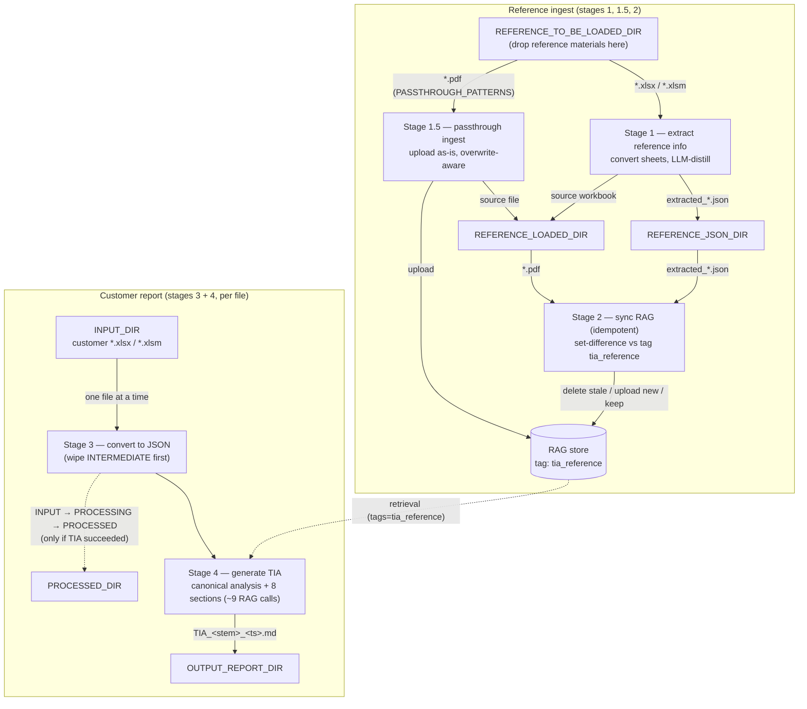

# OnlineTIA

A Python pipeline that turns Blue Prism **Technical Infrastructure Assessment
(TIA)** customer responses into Markdown assessment reports. It maintains a
RAG knowledge base populated from two kinds of reference materials —
**TIA reference workbooks** (Excel, sheet-by-sheet LLM-distilled before
upload) and **passthrough documents** (PDFs and similar, uploaded directly
without conversion) — then, for each customer response workbook, runs a
RAG-grounded LLM call that combines the customer's data with the most
relevant reference chunks and writes the resulting TIA report to disk.

## Architecture / data flow

`run.py` runs **four stages** in this order on every invocation:



`REFERENCE_LOADED_DIR` now holds **both** kinds of successfully-ingested
reference materials — graduated xlsx (from stage 1) and passthrough files
like PDFs (from stage 1.5). The stage-2 sync gate scans the union of
LLM-extracted JSONs (in `REFERENCE_JSON_DIR`) and passthrough files (in
`REFERENCE_LOADED_DIR`) so RAG stays consistent with the local source of
truth.

Each customer file is processed **independently and sequentially** — the
intermediate JSON store never holds more than one file's content at a time,
and each TIA report is based on exactly one input file.

## Supported reference file types

| Extension | Lifecycle | Module |
|-----------|-----------|--------|
| `.xlsx`, `.xlsm` | **Extraction**: Excel → per-sheet JSON → LLM-distilled `extracted_*.json` → RAG upload via the sync gate. Source workbook moves to `REFERENCE_LOADED_DIR` after successful conversion. | `reference_info_extractor.py` |
| `.pdf` | **Passthrough**: uploaded as-is to RAG (no client-side parsing — the gateway handles chunking/vectorization). Source PDF moves to `REFERENCE_LOADED_DIR` after successful upload. | `reference_passthrough_ingester.py` |

The passthrough patterns are configured in
`src/reference_passthrough_ingester.py`:

```python
PASSTHROUGH_PATTERNS: tuple[str, ...] = ("*.pdf",)
```

Adding more passthrough types (e.g. `.docx`, `.txt`) is a one-line change
— append the glob to the tuple. The upload path is content-agnostic.

## Modules

All source modules live under `src/` for neatness; `run.py` is the
only Python file at the project root.

| File | What it does |
|------|-------------|
| `run.py` | CLI entry point. Runs all four stages in the order above. |
| `src/reference_info_extractor.py` | Stage 1 orchestrator: reference Excel → JSON → LLM-extracted JSON. |
| `src/reference_passthrough_ingester.py` | Stage 1.5 orchestrator: glob non-Excel patterns in the inbox → direct RAG upload (overwrite-aware) → move to LOADED. |
| `src/excel_to_json.py` | `ExcelToJsonConverter` — Excel→JSON conversion + claim/processed move lifecycle. |
| `src/reference_json_combiner.py` | `ReferenceJsonCombiner` — per-sheet LLM extraction via `/v1/chat/completions`. |
| `src/rag_ingester.py` | `RagIngester` — list/register/upload/delete against `/rag/ingest/*`, with basename-equality sync gate (now supports `extra_files` for cross-dir local sets). |
| `src/tia_generator.py` | `TiaReportGenerator` — generates the Markdown TIA via `/rag/chat/completions`, **one section at a time** (the endpoint hard-caps output near ~4096 tokens, so a single all-in-one call truncates), then concatenates. Warns if any section nears the cap. |
| `src/logging_setup.py` | `configure_logging` + `bootstrap` (.env load + required-var check + logging). |

Four of the modules (`reference_info_extractor.py`,
`reference_passthrough_ingester.py`, `rag_ingester.py`,
`tia_generator.py`) can also be invoked as standalone harnesses for
testing individual stages — each has its own `bootstrap()` call and
`if __name__ == "__main__":` block at the bottom.

## Prerequisites

- **Python 3.10+** (uses PEP 604 `int | str` annotations).
- **Network access** to:
  - `api-ai.ssnc.cloud` (chat-completions endpoint, used by the reference
    extraction stage and customer TIA generation).
  - `api-ai-us.ssnc-corp.cloud` (RAG endpoints, used by all three RAG
    interactions: passthrough upload, sync, and TIA retrieval).
- A valid **SS&C Cloud AI Gateway API key** and **User ID** with access to
  the configured model (default `global.anthropic.claude-sonnet-4-6`).
- A registered **use-case ID** for AI Gateway billing/governance.

No system-level dependencies (no SQL, no Docker, no compilation).

## Deployment / setup on a new Windows machine

PowerShell commands shown; bash/zsh equivalent should be obvious.

### 1. Clone / unzip the project somewhere

```powershell
cd C:\blueprism
git clone <repo url> OnlineTIA
cd OnlineTIA
```

(Or copy the project tree manually — there's no build artifact to fetch.)

### 2. Create and activate a virtual environment

```powershell
python -m venv .venv
.\.venv\Scripts\Activate.ps1
```

If activation is blocked by execution policy:
`Set-ExecutionPolicy -Scope Process -ExecutionPolicy RemoteSigned` then retry.

### 3. Install Python dependencies

```powershell
& .\.venv\Scripts\python.exe -m pip install --upgrade pip
& .\.venv\Scripts\python.exe -m pip install -r requirements.txt
```

This installs four packages: `openpyxl`, `python-dotenv`, `requests`, and
`pytest` (needed for running the test suite).

### 4. Create the working-directory tree

The pipeline expects nine directories to exist (it auto-creates output
subdirs when missing, but pre-creating everything avoids first-run noise).
Default layout:

```powershell
$base = "C:\blueprism\OnlineTIAWorkingDir"
$dirs = @(
    "InputCustomerResponseExcel",
    "IntermediateCustomerResponseJson",
    "Processing", "Processed",
    "OutputReport",
    "ReferenceToBeLoaded", "ReferenceLoaded",
    "ReferenceJson",
    "Logs"
)
foreach ($d in $dirs) { New-Item -ItemType Directory -Force "$base\$d" | Out-Null }
```

Change `$base` if you want a different root — make sure the `.env` paths
match.

### 5. Configure `.env`

```powershell
Copy-Item .env.example .env
```

Then open `.env` and:
- Paste the real value for `SSC_CLOUD_AIGATEWAY_API_KEY`,
  `SSC_CLOUD_AIGATEWAY_USER_ID`, and `USE_CASE_ID`.
- Adjust any path env vars if your working-dir root differs from the default.
- Optionally tune `LOG_LEVEL` (default `INFO`).

`.env` is gitignored by design — never commit it.

### 6. (Optional) Drop reference material into the inbox

If you want the first run to actually populate RAG, drop reference
material into `REFERENCE_TO_BE_LOADED_DIR`:

- A TIA reference workbook (e.g.
  `Technical Infrastructure Assessment V2.6.4.xlsm`) goes through the
  extraction lifecycle.
- A PDF reference (e.g. an installation or admin guide) goes through the
  passthrough lifecycle.

Both kinds can sit in the same inbox; each is handled by its own stage.
Otherwise, both stages no-op and the RAG sync runs against whatever's
already in the RAG store at the gateway.

### 7. Run

```powershell
& .\.venv\Scripts\python.exe run.py
```

Expected: `=== run.py start ===` banner, four stage banners, exit 0. See
`Logs\logs.txt` for the full trace.

## Configuration reference

Every variable listed below is required in `.env` (the entry point's
`bootstrap()` call exits with code 2 if any are missing).

### Working-directory paths

| Variable | Purpose | Read by |
|----------|---------|---------|
| `INPUT_DIR` | Customer workbooks to be processed (xlsx/xlsm). | `run.py` |
| `INTERMEDIATE_JSON_DIR` | Per-sheet JSON output from customer conversion. Wiped before each customer file is processed. | `run.py`, `tia_generator.py` |
| `PROCESSING_DIR` | In-flight customer xlsx (claimed but not yet graduated). | `run.py` |
| `PROCESSED_DIR` | Customer xlsx graduates here after successful conversion. | `run.py` |
| `OUTPUT_REPORT_DIR` | Generated `TIA_<stem>_<timestamp>.md` reports. | `run.py`, `tia_generator.py` |
| `REFERENCE_TO_BE_LOADED_DIR` | Heterogeneous inbox: xlsx/xlsm reference workbooks AND passthrough files (e.g. *.pdf). Each file type is picked up by its own stage. | `reference_info_extractor.py`, `reference_passthrough_ingester.py` |
| `REFERENCE_LOADED_DIR` | Successfully-ingested reference materials of **all types** graduate here. Holds the source xlsx (from stage 1) and the PDFs (from stage 1.5). Stage 2 scans this dir for passthrough files when building the sync-gate local set. | `reference_info_extractor.py`, `reference_passthrough_ingester.py`, `run.py` |
| `REFERENCE_JSON_DIR` | Holds both kinds of Excel-derived artifacts: source per-sheet JSON (`<workbook>__<sheet>.json`, wiped before each reference convert) and the LLM-distilled per-sheet extractions (`extracted_<sheet>_<ts>.json`, selectively wiped before each extract). The `extracted_*.json` files are the source for RAG ingest. | `reference_info_extractor.py`, `reference_json_combiner.py`, `run.py`, `rag_ingester.py` |
| `LOG_DIR` | Holds `logs.txt` (append-mode across runs). | all entry points |

### Logging

| Variable | Purpose |
|----------|---------|
| `LOG_LEVEL` | `DEBUG`, `INFO`, `WARNING`, `ERROR`, or `CRITICAL` (case-insensitive). Unknown values fall back to `INFO`. At `DEBUG` the RAG `listfiles` full JSON dump is included. |

### SS&C Cloud AI Gateway

| Variable | Purpose |
|----------|---------|
| `SSC_CLOUD_AIGATEWAY_API_KEY` | Auth — sent as `Authorization: Bearer ...` for `/v1/chat/completions`, and as `X-API-Key: ...` for all `/rag/...` endpoints. |
| `SSC_CLOUD_AIGATEWAY_USER_ID` | Sent as `X-User-Id` on `/v1/chat/completions` calls (reference extraction stage only). |
| `SSC_CLOUD_AIGATEWAY_BASE_URL` | Gateway root (default `https://api-ai.ssnc.cloud`). The same host serves both the OpenAI-compatible chat-completions endpoint (`/v1/chat/completions`) and the RAG endpoints (`/rag/...`); the path prefixes are appended by the code, so this var is just the host. An internal alias `https://api-ai-us.ssnc-corp.cloud` also exists but is only resolvable on the SS&C corporate network/VPN. |
| `SSC_CLOUD_AIGATEWAY_MODEL` | Model name passed as `model` / `llm_name` in the LLM calls. |
| `USE_CASE_ID` | Sent as `X-Use-Case-Id` on `/v1/chat/completions` calls (reference extraction stage only). |

## Running individual stages

Each of these can be invoked directly for testing one stage in isolation:

```powershell
# Stage 1 only: reference Excel → per-sheet JSON → LLM-distilled JSON.
& .\.venv\Scripts\python.exe src\reference_info_extractor.py

# Stage 1.5 only: scan REFERENCE_TO_BE_LOADED_DIR for passthrough files
# (*.pdf etc.), upload each directly to RAG, and move it to LOADED.
& .\.venv\Scripts\python.exe src\reference_passthrough_ingester.py

# Stage 2 only: sync RAG with the extracted_*.json files currently in REFERENCE_JSON_DIR.
# (NB: the standalone harness ignores passthrough files in LOADED — only
# run.py composes the full union. Run this for narrow RAG-vs-extractions
# debugging.)
& .\.venv\Scripts\python.exe src\rag_ingester.py

# Stages 3+4 in isolation: generate a TIA from whatever's currently in
# INTERMEDIATE_JSON_DIR. (Doesn't run the per-file isolation loop; uses
# whatever happens to be in that directory.)
& .\.venv\Scripts\python.exe src\tia_generator.py
```

## User Guide

Once deployment is complete (see *Deployment / setup* above), day-to-day
usage is built around scheduling `run.py` and dropping files into the
inbox directories. This section walks an operator through the model.

### Prerequisite

Before scheduling anything, confirm:

- `.env` has been copied from `.env.example` and filled in with valid
  SS&C Cloud credentials (Deployment step 5).
- All nine working directories from the *Configuration reference* tables
  exist on disk (Deployment step 4).
- The machine has network access to both gateway hosts
  (`api-ai.ssnc.cloud` and `api-ai-us.ssnc-corp.cloud`).

### Schedule `run.py` periodically

The pipeline is designed to be invoked on a fixed schedule — e.g. every
30 minutes — rather than run as a long-lived service. On Windows use
**Task Scheduler** to fire the venv-Python at `run.py` on whatever cadence
fits your turnaround target:

```
C:\blueprism\OnlineTIA\.venv\Scripts\python.exe C:\blueprism\OnlineTIA\run.py
```

Each invocation is a single short-lived process. If both inbox directories
are empty when it fires, the whole run is a no-op finishing in
milliseconds — so a tight schedule is safe.

### What happens on each run

Each `run.py` invocation does up to **two distinct kinds of work** in
sequence, each triggered only when its inbox has files. With both inboxes
empty, the run logs the skip lines and exits.

#### 1. Reference material ingest — triggered by files in `REFERENCE_TO_BE_LOADED_DIR`

This is how you populate the RAG knowledge base that the final report
draws on. The inbox is **heterogeneous** — drop in any mix of supported
reference materials and each is handled by its own lifecycle.

**1a. Excel reference workbooks (`.xlsx`, `.xlsm`)** — for documents that
benefit from per-sheet LLM distillation (TIA templates with scoring
guidance, recommended configurations, severity rubrics). The pipeline:

1. **Converts** each sheet to a per-sheet JSON file in
   `REFERENCE_JSON_DIR`. Pure local Excel-to-JSON pass; no LLM involved.
2. **Extracts the useful content** from each sheet via an LLM call,
   writing `extracted_<sheet>_<YYYYMMDD_HHMMSS>.json` back into
   `REFERENCE_JSON_DIR` alongside the source per-sheet JSONs.
3. **Moves** the source workbook to `REFERENCE_LOADED_DIR` so it isn't
   re-processed on the next run.

**1b. Passthrough files (currently `.pdf`)** — for documents that should
go straight to RAG without client-side parsing (installation manuals,
admin guides, reference whitepapers). The pipeline:

1. **Uploads** the file directly to RAG with the same `tia_reference`
   tag the Excel extractions use, so chat retrieval treats them as one
   pool.
2. If a file of the same basename already exists in RAG, the prior
   entry is **deleted first** (overwrite semantics — re-dropping a PDF
   with the same name replaces what's there).
3. **Moves** the source file to `REFERENCE_LOADED_DIR`, overwriting any
   stale local copy. The PDF in `REFERENCE_LOADED_DIR` is what the
   stage-2 sync gate uses to confirm "yes, this file is in RAG."

**1c. After both 1a and 1b run**, stage 2 syncs RAG with the combined
local set: every `extracted_*.json` in `REFERENCE_JSON_DIR` plus every
passthrough file in `REFERENCE_LOADED_DIR`. If the basename set already
matches RAG, it skips entirely (idempotent re-run). Otherwise the stale
RAG entries are deleted and the fresh ones uploaded.

#### 2. Customer report generation — triggered by files in `INPUT_DIR`

This is how you generate a Technical Infrastructure Assessment report
for a customer. Drop a completed customer TIA response workbook into
`INPUT_DIR`. The next `run.py` will, **for each workbook**:

1. **Convert** the workbook to per-sheet JSON in `INTERMEDIATE_JSON_DIR`
   (same Excel-to-JSON pass as the reference flow).
2. **Generate the TIA report** in two phases. First a **canonical
   analysis** call fixes the environment facts and the severity of every
   finding once (one operative value per figure, one severity per issue,
   one version-currency verdict). Then the report's ~8 sections
   (Executive Summary, Servers, Interactive Clients, Disaster Recovery,
   Security, General Environment, Findings & Recommendations, Outstanding
   Questions) are each generated by a separate `/rag/chat/completions`
   call that is **anchored to that shared analysis** — combining the
   customer's JSON data, the canonical analysis, and the most relevant
   reference chunks retrieved from the RAG database. The sections are
   concatenated into one Markdown document written to `OUTPUT_REPORT_DIR`
   as `TIA_<source_stem>_<YYYYMMDD_HHMMSS>.md` (~9 RAG calls total).

   > **Why section by section?** The RAG chat endpoint silently caps its
   > output near ~4096 tokens and ignores every max-token request
   > parameter. A single all-in-one call therefore truncates a
   > full-length report mid-content. Splitting the report keeps every
   > call well under the cap; the upfront canonical-analysis pass then
   > keeps the independently-generated sections consistent (same counts,
   > same severities, one version verdict). If any section still
   > approaches the cap,
   > a `TIA output may be TRUNCATED` WARNING is logged.

Each customer workbook is processed **independently and sequentially** —
`INTERMEDIATE_JSON_DIR` is wiped between files so each report is
grounded in exactly one customer's data. After successful processing the
source workbook graduates `INPUT_DIR → PROCESSING_DIR → PROCESSED_DIR`.
If TIA generation fails for a file (e.g. gateway unreachable), the
source xlsx is **left in `PROCESSING_DIR`** rather than graduating to
`PROCESSED_DIR`, so the next scheduled run retries it.

### Logs

Every operation is recorded in `LOG_DIR\logs.txt`, with ISO-style
timestamps on every line. The log captures: per-stage banners, every
per-file conversion outcome, every passthrough upload start / overwrite
/ OK / FAILED, every LLM call (initiation + success with sizes and
citations *or* failure with error), every RAG operation (list /
register / upload / delete), every wipe, and the final exit code per
`run.py` invocation.

`logs.txt` **auto-rotates** when it reaches 10 MB. Up to 5 historical
backups are kept (`logs.txt.1` … `logs.txt.5`), giving an effective
retention of ~60 MB before the oldest backup is dropped. No manual
rotation is needed.

Verbosity is controlled by **`LOG_LEVEL`** in `.env` — one of `DEBUG`,
`INFO`, `WARNING`, `ERROR`, `CRITICAL` (case-insensitive; unknown values
fall back to `INFO`). At `DEBUG` the RAG list-files response is also
dumped in full structured form. For day-to-day operation `INFO` is the
right setting.

## Outputs

- **TIA reports**: `OUTPUT_REPORT_DIR\TIA_<source_stem>_<YYYYMMDD_HHMMSS>.md`
  — one Markdown file per customer xlsx, with the source stem in the
  filename so per-file reports never collide.
- **Logs**: `LOG_DIR\logs.txt` — timestamped, captures every stage
  banner, every LLM call (start / OK / FAILED), every RAG operation,
  every passthrough upload, and the wipe events. Auto-rotates at 10 MB
  with 5 backups kept (`logs.txt.1` … `logs.txt.5`).

## Tests

### Where the tests live

All tests sit in the `tests/` folder at the project root, one file per
source module plus a smoke file:

```
tests/
├── conftest.py                                # adds src/ to sys.path
├── test_imports_smoke.py                      # every module imports cleanly
├── test_excel_to_json.py
├── test_logging_setup.py
├── test_rag_ingester.py
├── test_reference_json_combiner.py
├── test_reference_passthrough_ingester.py
└── test_tia_generator.py
```

### Prerequisite

`pytest` is already listed in `requirements.txt` and gets installed in
Deployment step 3. No extra install is needed before running the suite.

### Run the full suite

From the project root, using the venv-Python:

```powershell
& .\.venv\Scripts\python.exe -m pytest -q
```

Expected output ends with `109 passed in ~2s` and exit code 0. If you
see a failure, the line immediately above the summary identifies the
file and test name.

### Common execution variations

All commands below assume `pytest` is invoked through the venv-Python the
same way as the full-suite command above. The leading
`& .\.venv\Scripts\python.exe -m` is omitted for readability.

| Goal | Command |
|------|---------|
| Verbose, one line per test | `pytest -v` |
| Stop on the first failure | `pytest -x` |
| Run one file | `pytest tests\test_excel_to_json.py` |
| Run tests whose name matches a substring | `pytest -k safe_name` |
| Run one specific (parametrized) test | `pytest tests\test_excel_to_json.py::test_safe_name` |
| Run one specific parametrized case | `pytest "tests\test_excel_to_json.py::test_safe_name[Orders (Q1)-Orders_Q1]"` |
| Don't capture stdout (see `print` output) | `pytest -s` |
| Show local variables on failure | `pytest -l` |
| Combine, e.g. verbose + stop on first failure | `pytest -vx` |

### What the suite covers

- **Pure logic for every module** — `safe_name`, cell-value serialization,
  the per-sheet header / blank-row handling, `wipe_output`, the full
  `process_one` → `finalize_to_processed_dir` lifecycle, `_resolve_level`
  parsing, `bootstrap` env-var validation, `_sheet_name_from_filename`,
  `_read_customer_content`, `_build_user_message`, `_build_output_path`
  filename format, `_sha256`, `_build_rag_config`.
- **HTTP-mocked behaviour for `rag_ingester`** — the sync gate's
  match decision, the set-difference branch (only-stale deleted,
  only-new uploaded, intersection preserved, tag-isolated so other
  use-cases on the same gateway are invisible), the `extra_files`
  parameter folding into the basename comparison, empty source dir
  handling, and `_raise_for_status` / `list_files` HTTP-error +
  connection-error propagation.
- **HTTP-mocked behaviour for `reference_json_combiner._call_llm`** —
  happy-path JSON unwrap, HTTP non-2xx, ConnectionError →
  `GatewayUnreachable`, malformed outer JSON, inner content not JSON,
  inner content not an object, empty content.
- **HTTP-mocked behaviour for `tia_generator._call_rag_chat`** —
  happy-path content extraction, HTTP non-2xx, ConnectionError
  propagation, missing `content`, empty `content`, non-JSON body,
  citations-list absent without crashing.
- **End-to-end behaviour for `reference_passthrough_ingester`** with a
  stub RagIngester — fresh upload + move, overwrite-deletes-prior path,
  multiple prior-duplicate cleanup, upload failure leaves file in
  inbox, listfiles failure aborts the stage, partial-batch failure rc
  semantics, non-pattern files ignored.

### Offline guarantee

The suite never makes a real network call. `requests.get` and
`requests.post` are monkey-patched with `unittest.mock.patch` in the
RAG-ingester tests; the passthrough-ingester tests substitute a stub
RagIngester; Excel fixtures are built in memory via `openpyxl` inside
`tmp_path` directories per test. You can run the full suite on a
machine without VPN or gateway access.

## Troubleshooting

- **`Missing required env var(s) in .env: <name>`** — open `.env` and add
  the named variable. Most common after first checkout when `.env` was
  copied from `.env.example` but a placeholder was left blank.
- **`Cannot reach gateway at <url>`** — DNS/network issue. Verify the
  machine can resolve both `api-ai.ssnc.cloud` and
  `api-ai-us.ssnc-corp.cloud` (corporate VPN may be required).
- **`HTTP 404: Unsupported path`** — usually means
  `SSC_CLOUD_AIGATEWAY_BASE_URL` is wrong.
  The base URL must NOT include `/chat/completions` or `/rag/ingest/...`
  — those path segments are appended by the code.
- **`No xlsx in <inbox>; skipping convert and extract stages`** — expected
  when the reference inbox has no Excel files. Drop one into
  `REFERENCE_TO_BE_LOADED_DIR` to trigger stage 1.
- **`No passthrough files in <inbox> ...; stage is a no-op`** — expected
  when the reference inbox has no PDFs (or other configured passthrough
  patterns). Drop one to trigger stage 1.5.
- **`overwrite: deleting prior RAG entry file_id=<id> for <name>`** —
  informational. You re-dropped a file whose basename was already in
  RAG; the prior entry is being replaced. If you didn't expect to see
  this, check whether the same PDF was previously ingested.
- **`passthrough upload FAILED for <name>: ...`** — RAG upload errored.
  The file stays in the inbox so the next scheduled run retries
  automatically. If the failure persists, check gateway reachability,
  API key, and that `SSC_CLOUD_AIGATEWAY_BASE_URL` is correct.
- **`Cannot list RAG files; aborting passthrough stage`** — stage 1.5
  refused to upload anything because it couldn't read the current RAG
  inventory (and so couldn't safely deduplicate). Inbox is left
  untouched; usually a transient gateway issue.
- **`--- stage: generate TIA report (skipped: no files in INPUT_DIR) ---`**
  — expected when no customer workbooks are present. Drop one into
  `INPUT_DIR` to trigger the per-file primary + TIA loop.
- **RAG sync re-uploads on every reference run** — every reference
  extract pass produces fresh timestamped `extracted_*.json` filenames,
  so the sync gate's set-difference sees old extractions as stale and
  the new ones as new (delete + upload, one for one). If you want to
  avoid the churn, don't re-run the reference extract stage (leave
  `REFERENCE_TO_BE_LOADED_DIR` empty for xlsx). Passthrough files
  alone do **not** cause this — their basenames are stable across
  runs.
- **`logs.txt` keeps growing** — it shouldn't past 10 MB. If you see
  a single `logs.txt` much larger than that, the rotation handler
  isn't picking up (rare; typically a permissions or
  multi-process-write contention issue). Confirm with
  `Get-Item logs.txt | Select-Object Length`, and look for
  `logs.txt.1` … `logs.txt.5` siblings — those are the rotated
  backups. Delete them manually if you want to reclaim disk.
