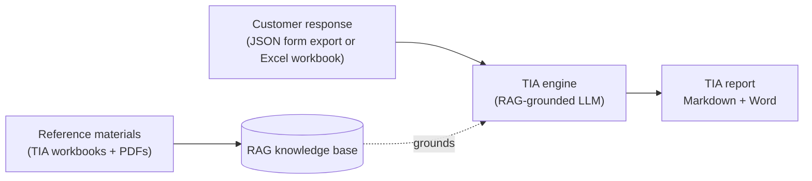
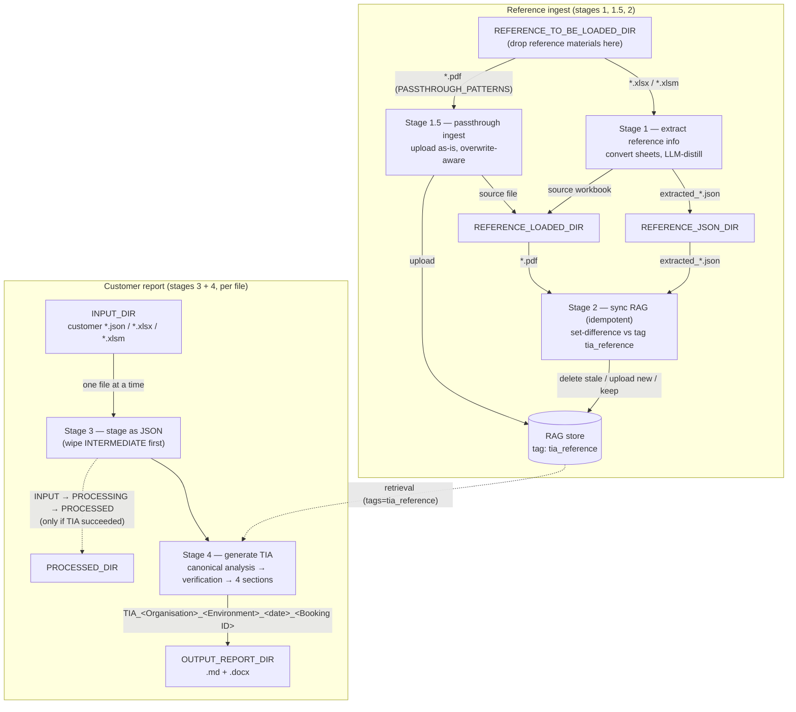

# OnlineTIA

A Python pipeline that turns Blue Prism **Technical Infrastructure Assessment
(TIA)** customer responses into Markdown assessment reports. It maintains a
RAG knowledge base populated from two kinds of reference materials —
**TIA reference workbooks** (Excel, sheet-by-sheet LLM-distilled before
upload) and **passthrough documents** (PDFs and similar, uploaded directly
without conversion) — then, for each customer response (JSON form export
or Excel workbook), runs a RAG-grounded generation that combines the
customer's data with the most relevant reference chunks and writes the
resulting TIA report to disk.

## Architecture / data flow

### At a glance

The whole system in one picture: reference materials build a searchable
knowledge base; a customer's response is assessed against it; out
comes a report in Markdown **and** Word.


```mermaid
flowchart LR
    REF["Reference materials<br/>(TIA workbooks + PDFs)"] --> KB[("RAG knowledge base")]
    CUST["Customer response<br/>(JSON form export or Excel workbook)"] --> ENGINE["TIA engine<br/>(RAG-grounded LLM)"]
    KB -. grounds .-> ENGINE
    ENGINE --> OUT["TIA report<br/>Markdown + Word"]
```

### Detailed flow

`run.py` runs **four stages** in this order on every invocation:


```mermaid
flowchart TD
    subgraph REF["Reference ingest (stages 1, 1.5, 2)"]
        direction TB
        TBL["REFERENCE_TO_BE_LOADED_DIR<br/>(drop reference materials here)"]
        TBL -->|"*.xlsx / *.xlsm"| S1["Stage 1 — extract reference info<br/>convert sheets, LLM-distill"]
        TBL -->|"*.pdf (PASSTHROUGH_PATTERNS)"| S15["Stage 1.5 — passthrough ingest<br/>upload as-is, overwrite-aware"]
        S1 -->|"extracted_*.json"| RJ["REFERENCE_JSON_DIR"]
        S1 -->|"source workbook"| RL["REFERENCE_LOADED_DIR"]
        S15 -->|"source file"| RL
        RJ -->|"extracted_*.json"| S2["Stage 2 — sync RAG (idempotent)<br/>set-difference vs tag tia_reference"]
        RL -->|"*.pdf"| S2
        S15 -->|"upload"| RAG[("RAG store<br/>tag: tia_reference")]
        S2 -->|"delete stale / upload new / keep"| RAG
    end

    subgraph CUST["Customer report (stages 3 + 4, per file)"]
        direction TB
        IN["INPUT_DIR<br/>customer *.json / *.xlsx / *.xlsm"]
        IN -->|"one file at a time"| S3["Stage 3 — stage as JSON<br/>(wipe INTERMEDIATE first)"]
        S3 --> S4["Stage 4 — generate TIA<br/>canonical analysis → verification → 4 sections"]
        S4 -->|"TIA_&lt;Organisation&gt;_&lt;Environment&gt;_&lt;date&gt;_&lt;Booking ID&gt;"| OUT["OUTPUT_REPORT_DIR<br/>.md + .docx"]
        S3 -.->|"INPUT → PROCESSING → PROCESSED<br/>(only if TIA succeeded)"| PROC["PROCESSED_DIR"]
    end

    RAG -. "retrieval (tags=tia_reference)" .-> S4
```

`REFERENCE_LOADED_DIR` now holds **both** kinds of successfully-ingested
reference materials — graduated xlsx (from stage 1) and passthrough files
like PDFs (from stage 1.5). The stage-2 sync gate scans the union of
LLM-extracted JSONs (in `REFERENCE_JSON_DIR`) and passthrough files (in
`REFERENCE_LOADED_DIR`) so RAG stays consistent with the local source of
truth.

Each customer file is processed **independently and sequentially** — the
intermediate JSON store never holds more than one file's content at a time,
and each TIA report is based on exactly one input file.

## Supported reference file types

| Extension | Lifecycle | Module |
|-----------|-----------|--------|
| `.xlsx`, `.xlsm` | **Extraction**: Excel → per-sheet JSON → LLM-distilled `extracted_*.json` → RAG upload via the sync gate. Source workbook moves to `REFERENCE_LOADED_DIR` after successful conversion. | `reference_info_extractor.py` |
| `.pdf` | **Passthrough**: uploaded as-is to RAG (no client-side parsing — the gateway handles chunking/vectorization). Source PDF moves to `REFERENCE_LOADED_DIR` after successful upload. | `reference_passthrough_ingester.py` |

The passthrough patterns are configured in
`src/reference_passthrough_ingester.py`:

```python
PASSTHROUGH_PATTERNS: tuple[str, ...] = ("*.pdf",)
```

Adding more passthrough types (e.g. `.docx`, `.txt`) is a one-line change
— append the glob to the tuple. The upload path is content-agnostic.

## Supported customer input types

Customer responses dropped into `INPUT_DIR` may arrive in either format —
both share the same PROCESSING/PROCESSED lifecycle and per-file isolation:

| Extension | Handling | Report name |
|-----------|----------|-------------|
| `.json` | **Form export** from the online TIA form, written by the Power Automate flow. Each answered field is `{"question": <exact form wording>, "answer": <response>}`; plain values (e.g. `"Submission time"`) are submission metadata and get no assessment row. Validated (must parse as a JSON object; UTF-8 BOM tolerated) and staged as-is into `INTERMEDIATE_JSON_DIR`. | `TIA_<Organisation>_<Environment>_<submission date>_<Booking ID>.md` — each absent segment is dropped; no Organisation falls back to the file stem. |
| `.xlsx`, `.xlsm` | **Workbook**: converted to one JSON per sheet (`{stem}__{sheet}.json`), reference-scaffolding sheets excluded downstream. | `TIA_<file stem>.md` |

The accepted patterns are `CUSTOMER_INPUT_PATTERNS` in `src/excel_to_json.py`.

## Modules

All source modules live under `src/` for neatness; `run.py` is the
only Python file at the project root.

| File | What it does |
|------|-------------|
| `run.py` | CLI entry point. Runs all four stages in the order above. |
| `src/reference_info_extractor.py` | Stage 1 orchestrator: reference Excel → JSON → LLM-extracted JSON. Retires superseded workbook versions into `REFERENCE_LOADED_DIR\Superseded\`. |
| `src/reference_passthrough_ingester.py` | Stage 1.5 orchestrator: glob non-Excel patterns in the inbox → direct RAG upload (overwrite-aware) → move to LOADED. |
| `src/excel_to_json.py` | `ExcelToJsonConverter` — Excel→JSON conversion + claim/processed move lifecycle. |
| `src/reference_sheet_extractor.py` | `ReferenceSheetExtractor` — per-sheet LLM extraction via `/v1/chat/completions`. |
| `src/rag_ingester.py` | `RagIngester` — list/register/upload/delete against `/rag/ingest/*`, with basename-equality sync gate (now supports `extra_files` for cross-dir local sets). |
| `src/tia_generator.py` | `TiaReportGenerator` — generates the Markdown TIA via `/rag/chat/completions`, **one section at a time** (scopes RAG retrieval per topic and bounds each call's output), then concatenates. Key Findings and the Detailed Assessment blocks are rendered in code from the analysis ledger, not asked for. Warns if the gateway's `finish_reason` signals a truncated section. |
| `src/docx_writer.py` | `write_docx` — renders the report into the branded Word template (`assets/tia_template.docx`): fills the cover with the customer's Organisation and assessment date, maps the Markdown to native Word styles. Falls back to a blank document if the template is missing. |
| `src/logging_setup.py` | `configure_logging` + `bootstrap` (.env load + required-var check + logging). |
| `src/http_resilient.py` | `call_resilient` — hard wall-clock cap + bounded retry around each gateway call so a stall can't hang the run. |

`run.py` is the single entry point; the stage modules are imported and
driven by it.

## Prerequisites

- **Python 3.10+** (uses PEP 604 `int | str` annotations).
- **Network access** to:
  - `api-ai.ssnc.cloud` (chat-completions endpoint, used by the reference
    extraction stage and customer TIA generation).
  - `api-ai-us.ssnc-corp.cloud` (RAG endpoints, used by all three RAG
    interactions: passthrough upload, sync, and TIA retrieval).
- A valid **SS&C Cloud AI Gateway API key** and **User ID** with access to
  the configured model (default `global.anthropic.claude-sonnet-4-6`).
- A registered **use-case ID** for AI Gateway billing/governance.

No system-level dependencies (no SQL, no Docker, no compilation).

## Deployment / setup on a new Windows machine

First-time setup. To refresh a machine that already runs the pipeline, see
[Updating to the latest version](#updating-to-the-latest-version-from-github)
instead. Commands are `cmd.exe`.

### 1. Clone the project

```cmd
cd /d C:\blueprism
git clone https://github.com/alfredlauyongfu/OnlineTIA.git OnlineTIA
cd OnlineTIA
```

(Or copy the project tree manually — there's no build artifact to fetch. A
tree copied rather than cloned has no `.git`, so it can only be updated by
copying again.)

### 2. Create and activate a virtual environment

```cmd
python -m venv .venv
.venv\Scripts\activate.bat
```

### 3. Install Python dependencies

```cmd
.venv\Scripts\python.exe -m pip install --upgrade pip
.venv\Scripts\python.exe -m pip install -r requirements.txt
```

This installs five packages: `openpyxl`, `python-dotenv`, `requests`,
`python-docx` (for the Word report output), and `pytest` (needed for
running the test suite).

### 4. Create the working-directory tree

The pipeline expects nine directories to exist (it auto-creates output
subdirs when missing, but pre-creating everything avoids first-run noise).
Default layout:

```cmd
mkdir C:\blueprism\OnlineTIAWorkingDir
cd /d C:\blueprism\OnlineTIAWorkingDir
mkdir InputCustomerResponse IntermediateCustomerResponseJson Processing Processed OutputReport ReferenceToBeLoaded ReferenceLoaded ReferenceJson Logs
```

Change the root if you want it elsewhere — make sure the `.env` paths match.

If the working-dir root is a **OneDrive-synced folder** (the production
layout — see [ADMIN_GUIDE.md](ADMIN_GUIDE.md)), right-click it in File
Explorer and choose **"Always keep on this device"** so every synced file
is fully downloaded; the pipeline cannot read online-only placeholder
files under a service account.

### 5. Configure `.env`

```cmd
copy .env.example .env
```

Then open `.env` and:
- Paste the real value for `SSC_CLOUD_AIGATEWAY_API_KEY`,
  `SSC_CLOUD_AIGATEWAY_USER_ID`, and `USE_CASE_ID`.
- Adjust any path env vars if your working-dir root differs from the default.
- Optionally tune `LOG_LEVEL` (default `INFO`).

`.env` is gitignored by design — never commit it.

### 6. (Optional) Drop reference material into the inbox

If you want the first run to actually populate RAG, drop reference
material into `REFERENCE_TO_BE_LOADED_DIR`:

- A TIA reference workbook (e.g.
  `Technical Infrastructure Assessment V2.6.4.xlsm`) goes through the
  extraction lifecycle.
- A PDF reference (e.g. an installation or admin guide) goes through the
  passthrough lifecycle.

Both kinds can sit in the same inbox; each is handled by its own stage.
Otherwise, both stages no-op and the RAG sync runs against whatever's
already in the RAG store at the gateway.

### 7. Run

```cmd
.venv\Scripts\python.exe run.py
```

Expected: `=== run.py start ===` banner, four stage banners, exit 0. See
`Logs\logs.txt` for the full trace.

## Updating to the latest version from GitHub

For a machine already running the pipeline. Nothing in the working-dir tree
(`OnlineTIAWorkingDir`) is touched — code and working data are separate.

### 1. Stop the schedule

In **Task Scheduler**, select the OnlineTIA task → **End** any running
instance, then **Disable** it. An update landing mid-run would swap modules
under a live process.

### 2. See what is local before pulling

```cmd
cd /d C:\blueprism\OnlineTIA
git status
```

`.env`, `.venv\`, `drafts\` and `intake\power_automate_flow.json` are
gitignored and never appear here. Anything else listed as modified is a local
edit to a tracked file and will block the merge — copy it aside, then
`git checkout -- <path>` to discard it.

If the branch line reports anything other than `main`, switch first:

```cmd
git checkout main
```

### 3. Pull

```cmd
git pull origin main
```

### 4. Reinstall dependencies

Cheap and idempotent when nothing changed; skipping it after a release that
added a package produces an import error on the next run.

```cmd
.venv\Scripts\python.exe -m pip install -r requirements.txt
```

### 5. Reconcile `.env` with the template

```cmd
git diff HEAD@{1} HEAD -- .env.example
```

Empty output means no action. Any variable added to the template must be
added to your `.env` by hand — `bootstrap()` exits with code 2 when a
required one is missing, before any work is done.

### 6. Verify, then re-enable

```cmd
.venv\Scripts\python.exe -m pytest -q
.venv\Scripts\python.exe run.py
```

Expect `283 passed` and an exit-0 run — a no-op finishing in milliseconds if
both inboxes are empty. Re-enable the scheduled task.

### Rolling back

```cmd
git log --oneline -5
git checkout <previous commit sha>
```

Then repeat steps 4–6. `git checkout main` returns to the tip.

### If the tree was copied rather than cloned

There is no `.git` to pull into. Download the ZIP from the repository's
**Code → Download ZIP**, unpack it elsewhere, then copy its contents over
`C:\blueprism\OnlineTIA` **excluding** `.env` — it is not in the ZIP, and
overwriting the folder wholesale would delete it. `.venv\` is likewise absent
from the ZIP and survives a copy-over; run steps 4–6 afterwards.

## Configuration reference

Every variable listed below is required in `.env` (the entry point's
`bootstrap()` call exits with code 2 if any are missing).

### Working-directory paths

| Variable | Purpose | Read by |
|----------|---------|---------|
| `INPUT_DIR` | Customer responses to be processed — JSON form exports and/or xlsx/xlsm workbooks. | `run.py` |
| `INTERMEDIATE_JSON_DIR` | Per-sheet JSON output from customer conversion. Wiped before each customer file is processed. | `run.py`, `tia_generator.py` |
| `PROCESSING_DIR` | In-flight customer input file (claimed but not yet graduated). | `run.py` |
| `PROCESSED_DIR` | Customer input files graduate here after successful processing. | `run.py` |
| `OUTPUT_REPORT_DIR` | Generated `TIA_<Organisation>_<Environment>_<submission date>_<Booking ID>.md` reports. | `run.py`, `tia_generator.py` |
| `REFERENCE_TO_BE_LOADED_DIR` | Heterogeneous inbox: xlsx/xlsm reference workbooks AND passthrough files (e.g. *.pdf). Each file type is picked up by its own stage. | `reference_info_extractor.py`, `reference_passthrough_ingester.py` |
| `REFERENCE_LOADED_DIR` | Successfully-ingested reference materials of **all types** graduate here. Holds the source xlsx (from stage 1) and the PDFs (from stage 1.5). Stage 2 scans this dir for passthrough files when building the sync-gate local set. Superseded workbook versions are moved into a `Superseded\` subfolder, which the non-recursive scan ignores. | `reference_info_extractor.py`, `reference_passthrough_ingester.py`, `run.py` |
| `REFERENCE_JSON_DIR` | Holds both kinds of Excel-derived artifacts: source per-sheet JSON (`<workbook>__<sheet>.json`, wiped before each reference convert) and the LLM-distilled per-sheet extractions (`extracted_<sheet>_<ts>.json`, selectively wiped before each extract). The `extracted_*.json` files are the source for RAG ingest. | `reference_info_extractor.py`, `reference_sheet_extractor.py`, `run.py`, `rag_ingester.py` |
| `LOG_DIR` | Holds `logs.txt` (append-mode across runs). | all entry points |

### Logging

| Variable | Purpose |
|----------|---------|
| `LOG_LEVEL` | `DEBUG`, `INFO`, `WARNING`, `ERROR`, or `CRITICAL` (case-insensitive). Unknown values fall back to `INFO`. At `DEBUG` the RAG `listfiles` full JSON dump is included. |

### SS&C Cloud AI Gateway

| Variable | Purpose |
|----------|---------|
| `SSC_CLOUD_AIGATEWAY_API_KEY` | Auth — sent as `Authorization: Bearer ...` for `/v1/chat/completions`, and as `X-API-Key: ...` for all `/rag/...` endpoints. |
| `SSC_CLOUD_AIGATEWAY_USER_ID` | Sent as `X-User-Id` on `/v1/chat/completions` calls (reference extraction stage only). |
| `SSC_CLOUD_AIGATEWAY_BASE_URL` | Gateway root (default `https://api-ai.ssnc.cloud`). The same host serves both the OpenAI-compatible chat-completions endpoint (`/v1/chat/completions`) and the RAG endpoints (`/rag/...`); the path prefixes are appended by the code, so this var is just the host. An internal alias `https://api-ai-us.ssnc-corp.cloud` also exists but is only resolvable on the SS&C corporate network/VPN. |
| `SSC_CLOUD_AIGATEWAY_MODEL` | Model name passed as `model` / `llm_name` in the LLM calls. |
| `USE_CASE_ID` | Sent as `X-Use-Case-Id` on `/v1/chat/completions` calls (reference extraction stage only). |

## User Guide

Once deployment is complete (see *Deployment / setup* above), day-to-day
usage is built around scheduling `run.py` and dropping files into the
inbox directories. This section walks an operator through the model. For
the end-to-end service protocol around the pipeline (form intake, the
production schedule, review checklist, file lifecycle), see
[ADMIN_GUIDE.md](ADMIN_GUIDE.md). The intake chain that feeds the pipeline
is recorded in [intake/online_tia_form.json](intake/online_tia_form.json) —
the questionnaire's title, header text, sections, and every question with its
answer options, so the form can be recreated from this repo.

The Power Automate flow that turns a submission into the input JSON (and
sends the confirmation email) is **not committed**: its export carries tenant
and subscription GUIDs, the internal SharePoint path and staff email
addresses, and this repository is public. Export it from Power Automate to
`intake/power_automate_flow.json` to run the flow/form drift tests locally;
they skip when the file is absent.

### Prerequisite

Before scheduling anything, confirm:

- `.env` has been copied from `.env.example` and filled in with valid
  SS&C Cloud credentials (Deployment step 5).
- All nine working directories from the *Configuration reference* tables
  exist on disk (Deployment step 4).
- The machine has network access to both gateway hosts
  (`api-ai.ssnc.cloud` and `api-ai-us.ssnc-corp.cloud`).

### Schedule `run.py` periodically

The pipeline is designed to be invoked on a fixed schedule — e.g. every
30 minutes — rather than run as a long-lived service. On Windows use
**Task Scheduler** to fire the venv-Python at `run.py` on whatever cadence
fits your turnaround target:

```
C:\blueprism\OnlineTIA\.venv\Scripts\python.exe C:\blueprism\OnlineTIA\run.py
```

Each invocation is a single short-lived process. If both inbox directories
are empty when it fires, the whole run is a no-op finishing in
milliseconds — so a tight schedule is safe.

### What happens on each run

Each `run.py` invocation does up to **two distinct kinds of work** in
sequence, each triggered only when its inbox has files. With both inboxes
empty, the run logs the skip lines and exits.

#### 1. Reference material ingest — triggered by files in `REFERENCE_TO_BE_LOADED_DIR`

This is how you populate the RAG knowledge base that the final report
draws on. The inbox is **heterogeneous** — drop in any mix of supported
reference materials and each is handled by its own lifecycle.

**1a. Excel reference workbooks (`.xlsx`, `.xlsm`)** — for documents that
benefit from per-sheet LLM distillation (TIA templates with scoring
guidance, recommended configurations, severity rubrics). The pipeline:

1. **Converts** each sheet to a per-sheet JSON file in
   `REFERENCE_JSON_DIR`. Pure local Excel-to-JSON pass; no LLM involved.
2. **Extracts the useful content** from each sheet via an LLM call,
   writing `extracted_<sheet>_<YYYYMMDD_HHMMSS>.json` back into
   `REFERENCE_JSON_DIR` alongside the source per-sheet JSONs.
3. **Moves** the source workbook to `REFERENCE_LOADED_DIR` so it isn't
   re-processed on the next run, and **retires** any older version of the
   same workbook found there into `REFERENCE_LOADED_DIR\Superseded\`
   (`V2.6.4` retired by `V2.6.5` — the trailing version token is what
   identifies the family). Retired files are moved, never deleted, and the
   subfolder is invisible to the stage-2 scan, which globs
   `REFERENCE_LOADED_DIR` non-recursively.

**1b. Passthrough files (currently `.pdf`)** — for documents that should
go straight to RAG without client-side parsing (installation manuals,
admin guides, reference whitepapers). The pipeline:

1. **Uploads** the file directly to RAG with the same `tia_reference`
   tag the Excel extractions use, so chat retrieval treats them as one
   pool.
2. If a file of the same basename already exists in RAG, the prior
   entry is **deleted first** (overwrite semantics — re-dropping a PDF
   with the same name replaces what's there).
3. **Moves** the source file to `REFERENCE_LOADED_DIR`, overwriting any
   stale local copy. The PDF in `REFERENCE_LOADED_DIR` is what the
   stage-2 sync gate uses to confirm "yes, this file is in RAG."

**1c. After both 1a and 1b run**, stage 2 syncs RAG with the combined
local set: every `extracted_*.json` in `REFERENCE_JSON_DIR` plus every
passthrough file in `REFERENCE_LOADED_DIR`. If the basename set already
matches RAG, it skips entirely (idempotent re-run). Otherwise the stale
RAG entries are deleted and the fresh ones uploaded.

**If stage 1 failed**, the sync is skipped and the run exits non-zero — a
failed extraction (rate limit, spend cap, malformed response) leaves a
partial rubric on disk, and syncing it would delete the complete rubric in
RAG and replace it with the fragment. Every later report would then be
graded against a rubric missing whole topics with nothing to show it. RAG is
left as it is and the next run retries the extraction; the log line is
`RAG sync SKIPPED`.

#### 2. Customer report generation — triggered by files in `INPUT_DIR`

This is how you generate a Technical Infrastructure Assessment report
for a customer. Drop a completed customer TIA response into `INPUT_DIR` —
either a **JSON form export** from the online TIA form or an **Excel
workbook**. The next `run.py` will, **for each input file**:

1. **Stage** the input as JSON in `INTERMEDIATE_JSON_DIR`: Excel workbooks
   are converted per-sheet (same Excel-to-JSON pass as the reference
   flow); JSON form exports are validated and staged as-is.
2. **Generate the TIA report** in two phases. First a **canonical
   analysis** call fixes the environment facts and the criticality of
   every finding once (one operative value per figure, one criticality
   per issue on the Red Flag / Strong Recommendation / Recommendation /
   Suggestion scale). The analysis and its verification pass are
   additionally grounded by injecting the extracted reference scoring
   guidance (the per-answer criticality rubric from `REFERENCE_JSON_DIR`)
   directly into those calls — ratings come from the rubric, not from
   RAG-retrieval luck or the model's general knowledge. Each assessment
   block's heading is the **exact question the customer was asked**, taken
   in code from the form export's own `question` field (matched to the
   ledger row by its data key) rather than from the model's transcription
   of it. Then the report's **four sections** are assembled:

   | Section | Produced by | Content |
   |---|---|---|
   | Summary | `/rag/chat/completions` | Intro, answer-coverage line, criticality count table |
   | Key Findings | **code** | The flagged ledger rows, most severe first, capped at 12 |
   | Detailed Assessment | **code** | One Q&A block per ledger row, grouped by category: General Information, SQL Server, Application Server(s), Interactive Clients, Runtime Resources (Robots), Disaster Recovery, Security |
   | Outstanding Questions | `/rag/chat/completions` | Every question answered blank or "Don't know", grouped by category |

   The two LLM sections are **anchored to the shared analysis**, combining
   the customer's JSON data, the canonical analysis, and the most relevant
   reference chunks retrieved from RAG. The two code-rendered sections are
   derived from the analysis's Assessment Ledger, so every question appears
   exactly once and Key Findings cannot contradict the count table — as an
   LLM call it repeatedly did, inventing severities to meet a minimum count
   and listing rows the ledger had left unflagged. Each block prints the
   customer's answer **verbatim from the submission**, not the ledger's copy
   of it, which had been quietly abbreviating job titles and translating
   non-English answers; where the model's rendering genuinely differs in
   wording it is shown beneath as `Translation:`. A row whose answer is
   "Don't know" is labelled **Not assessed** rather than given a severity,
   and gets its own row in the count table. The sections are concatenated
   into one Markdown document written to `OUTPUT_REPORT_DIR` as
   `TIA_<Organisation>_<Environment>_<submission date>_<Booking ID>.md`
   (4 gateway calls total: analysis, verification, Summary, Outstanding
   Questions). A
   **Microsoft Word copy** (`.docx`) is then written alongside it from the
   same content — independently and best-effort. It is rendered into the
   SS&C / Blue Prism house-style template (`assets/tia_template.docx`:
   branded cover page, logo running-header, "Commercial in Confidence" +
   page-number footer, Arial Nova theme and Heading styles), with the
   customer's Organisation on the cover; the body maps natively (Heading 1/2,
   tables, lists) — not converted from the `.md` file. If the template is
   missing it falls back to a blank document, and if Word generation fails the
   `.md` is unaffected and the run still succeeds.

   > **Why section by section?** Generating each narrative section as its
   > own call scopes the RAG retrieval to that section's topic and keeps
   > each call's output bounded. The upfront canonical-analysis pass keeps
   > the independently-generated sections consistent (same criticalities).
   > The Summary count table is **recomputed in code** from the
   > criticalities actually rendered in the Detailed Assessment blocks, so
   > it can never disagree with the detail (LLM tally-copying drifts ±1),
   > and the coverage line above it is computed from the submitted answers
   > — a report where a third of the questions came back "Don't know" would
   > otherwise be indistinguishable from a clean one. A coverage guardrail
   > warns if the number of rendered assessment blocks doesn't match the
   > number of customer questions, and if the gateway's `finish_reason`
   > reports a truncated section a `TIA output TRUNCATED` WARNING is logged.

Each customer file is processed **independently and sequentially** —
`INTERMEDIATE_JSON_DIR` is wiped between files so each report is
grounded in exactly one customer's data. After successful processing the
source file graduates `INPUT_DIR → PROCESSING_DIR → PROCESSED_DIR`.
If TIA generation fails for a file (e.g. gateway unreachable), the
source file is **left in `PROCESSING_DIR`** rather than graduating to
`PROCESSED_DIR`, so the next scheduled run retries it.

### Logs

Every operation is recorded in `LOG_DIR\logs.txt`, with ISO-style
timestamps on every line. The log captures: per-stage banners, every
per-file conversion outcome, every passthrough upload start / overwrite
/ OK / FAILED, every LLM call (initiation + success with sizes and
citations *or* failure with error), every RAG operation (list /
register / upload / delete), every wipe, and the final exit code per
`run.py` invocation.

`logs.txt` **auto-rotates** when it reaches 10 MB. Up to 5 historical
backups are kept (`logs.txt.1` … `logs.txt.5`), giving an effective
retention of ~60 MB before the oldest backup is dropped. No manual
rotation is needed.

Verbosity is controlled by **`LOG_LEVEL`** in `.env` — one of `DEBUG`,
`INFO`, `WARNING`, `ERROR`, `CRITICAL` (case-insensitive; unknown values
fall back to `INFO`). At `DEBUG` the RAG list-files response is also
dumped in full structured form. For day-to-day operation `INFO` is the
right setting.

## Outputs

- **TIA reports**: each customer input yields a matching pair in
  `OUTPUT_REPORT_DIR` — `TIA_<Organisation>_<Environment>_<submission
  date>_<Booking ID>.md` (Markdown, authoritative) and the same-stem
  `.docx` (Microsoft Word, generated independently and best-effort), e.g.
  `TIA_Acme_Bank_Production_2026-09-16_BK123456.md`. Accents are
  transliterated, only the leading segment of the Organisation is used
  (customers often answer "Company - Department - Team"), and an absent
  segment is dropped. A response with no Organisation, or an Excel input,
  falls back to the source file's stem. The name carries no run timestamp,
  so re-running a submission **replaces** its previous report.
- **Logs**: `LOG_DIR\logs.txt` — timestamped, captures every stage
  banner, every LLM call (start / OK / FAILED), every RAG operation,
  every passthrough upload, and the wipe events. Auto-rotates at 10 MB
  with 5 backups kept (`logs.txt.1` … `logs.txt.5`).

## Tests

### Where the tests live

All tests sit in the `tests/` folder at the project root — one file per
source module, an imports smoke file, and shared helpers:

```
tests/
├── conftest.py                                # adds src/ to sys.path
├── helpers.py                                 # shared test fakes
├── test_imports_smoke.py                      # every module imports cleanly
├── test_docx_writer.py
├── test_excel_to_json.py
├── test_form_definition.py                    # form/flow drift vs intake/
├── test_http_resilient.py
├── test_logging_setup.py
├── test_rag_ingester.py
├── test_reference_info_extractor.py
├── test_reference_sheet_extractor.py
├── test_reference_sheet_extractor_prompt.py   # extraction prompt contract
├── test_reference_passthrough_ingester.py
├── test_run.py
└── test_tia_generator.py
```

### Prerequisite

`pytest` is already listed in `requirements.txt` and gets installed in
Deployment step 3. No extra install is needed before running the suite.

### Run the full suite

From the project root, using the venv-Python:

```cmd
.venv\Scripts\python.exe -m pytest -q
```

Expected output ends with `283 passed` (in a few seconds) and exit code 0. If you
see a failure, the line immediately above the summary identifies the
file and test name.

### Common execution variations

All commands below assume `pytest` is invoked through the venv-Python the
same way as the full-suite command above. The leading
`.venv\Scripts\python.exe -m` is omitted for readability.

| Goal | Command |
|------|---------|
| Verbose, one line per test | `pytest -v` |
| Stop on the first failure | `pytest -x` |
| Run one file | `pytest tests\test_excel_to_json.py` |
| Run tests whose name matches a substring | `pytest -k safe_name` |
| Run one specific (parametrized) test | `pytest tests\test_excel_to_json.py::test_safe_name` |
| Run one specific parametrized case | `pytest "tests\test_excel_to_json.py::test_safe_name[Orders (Q1)-Orders_Q1]"` |
| Don't capture stdout (see `print` output) | `pytest -s` |
| Show local variables on failure | `pytest -l` |
| Combine, e.g. verbose + stop on first failure | `pytest -vx` |

### What the suite covers

- **Pure logic for every module** — `safe_name`, cell-value serialization,
  the per-sheet header / blank-row handling, `wipe_output`, the full
  `process_one` → `finalize_to_processed_dir` lifecycle, `_resolve_level`
  parsing, `bootstrap` env-var validation, `_sheet_name_from_filename`,
  `_read_customer_content`, `_build_user_message`, `_build_output_path`
  filename format, `_sha256`, `_build_rag_config`.
- **HTTP-mocked behaviour for `rag_ingester`** — the sync gate's
  match decision, the set-difference branch (only-stale deleted,
  only-new uploaded, intersection preserved, tag-isolated so other
  use-cases on the same gateway are invisible), the `extra_files`
  parameter folding into the basename comparison, empty source dir
  handling, and `_raise_for_status` / `list_files` HTTP-error +
  connection-error propagation.
- **HTTP-mocked behaviour for `reference_sheet_extractor._call_llm`** —
  happy-path JSON unwrap, HTTP non-2xx, ConnectionError →
  `GatewayUnreachable`, malformed outer JSON, inner content not JSON,
  inner content not an object, empty content.
- **HTTP-mocked behaviour for `tia_generator._call_rag_chat`** —
  happy-path content extraction, HTTP non-2xx, ConnectionError
  propagation, missing `content`, empty `content`, non-JSON body,
  citations-list absent without crashing; plus the report-shape
  contracts (ideal-template section skeleton, four-level criticality
  scale, version-neutrality prompt rules, the version-near-"guide"
  log guardrail).
- **End-to-end behaviour for `reference_passthrough_ingester`** with a
  stub RagIngester — fresh upload + move, overwrite-deletes-prior path,
  multiple prior-duplicate cleanup, upload failure leaves file in
  inbox, listfiles failure aborts the stage, partial-batch failure rc
  semantics, non-pattern files ignored.
- **`docx_writer` against the branded template** — cover fill
  (Organisation Title, fixed Subtitle, assessment date), Markdown →
  native Word style mapping (Heading 1/2, tables, bold runs),
  missing-template fallback to a blank document, output parent-dir
  creation, and that no trace of the source document the template was
  derived from (headers, document properties, property-bound controls)
  reaches a generated report.
- **Reference-workbook retirement** — the version-family match, the
  move-not-delete into `Superseded\`, re-ingesting the same version
  retiring nothing, unrelated workbooks left alone, and the retired copy
  being invisible to the passthrough scan.
- **Prompt contracts** — the extraction prompt still requires verbatim
  question wording and canonical `guidance` / `remediation_steps` keys, and
  its size-compaction rule cannot cut remediation actions.
- **The intake record in `intake/`** — the form definition parses, keeps its
  expected question and section counts, still carries the questions the
  pipeline reads, and leaks no Microsoft-internal fields; the Power Automate
  flow emits the nested question/answer shape and its question wording
  matches the form verbatim. The flow tests skip when the gitignored export
  is absent.

### Offline guarantee

The suite never makes a real network call. `requests.get` and
`requests.post` are monkey-patched with `unittest.mock.patch` in the
RAG-ingester tests; the passthrough-ingester tests substitute a stub
RagIngester; Excel fixtures are built in memory via `openpyxl` inside
`tmp_path` directories per test. You can run the full suite on a
machine without VPN or gateway access.

## Troubleshooting

- **`Missing required env var(s) in .env: <name>`** — open `.env` and add
  the named variable. Most common after first checkout when `.env` was
  copied from `.env.example` but a placeholder was left blank.
- **`Cannot reach gateway at <url>`** — DNS/network issue. Verify the
  machine can resolve both `api-ai.ssnc.cloud` and
  `api-ai-us.ssnc-corp.cloud` (corporate VPN may be required).
- **A run seems stuck on a gateway call** — it can't hang indefinitely:
  every gateway call is wrapped (`src/http_resilient.py`) with a hard
  wall-clock cap (~5.5 min) plus one automatic retry, so a stalled or
  trickling connection (or a machine that slept mid-call) aborts and
  raises instead of blocking. Look for `resilient: … hit hard cap` /
  `… failed: … (attempt N/2)` WARNINGs in the log. If a TIA section
  still fails after the retry, a **partial report** is written (`.md` +
  `.docx`) with an `INCOMPLETE REPORT` banner naming the failed section,
  and the source file is left in `PROCESSING` so the next scheduled run
  regenerates it in full.
- **`HTTP 404: Unsupported path`** — usually means
  `SSC_CLOUD_AIGATEWAY_BASE_URL` is wrong.
  The base URL must NOT include `/chat/completions` or `/rag/ingest/...`
  — those path segments are appended by the code.
- **`No xlsx in <inbox>; skipping convert and extract stages`** — expected
  when the reference inbox has no Excel files. Drop one into
  `REFERENCE_TO_BE_LOADED_DIR` to trigger stage 1.
- **`No passthrough files in <inbox> ...; stage is a no-op`** — expected
  when the reference inbox has no PDFs (or other configured passthrough
  patterns). Drop one to trigger stage 1.5.
- **`overwrite: deleting prior RAG entry file_id=<id> for <name>`** —
  informational. You re-dropped a file whose basename was already in
  RAG; the prior entry is being replaced. If you didn't expect to see
  this, check whether the same PDF was previously ingested.
- **`passthrough upload FAILED for <name>: ...`** — RAG upload errored.
  The file stays in the inbox so the next scheduled run retries
  automatically. If the failure persists, check gateway reachability,
  API key, and that `SSC_CLOUD_AIGATEWAY_BASE_URL` is correct.
- **`Cannot list RAG files; aborting passthrough stage`** — stage 1.5
  refused to upload anything because it couldn't read the current RAG
  inventory (and so couldn't safely deduplicate). Inbox is left
  untouched; usually a transient gateway issue.
- **`--- stage: generate TIA report (skipped: no files in INPUT_DIR) ---`**
  — expected when no customer workbooks are present. Drop one into
  `INPUT_DIR` to trigger the per-file primary + TIA loop.
- **`FAILED <name>: [Errno 22] Invalid argument`** or
  **`... is a OneDrive online-only placeholder`** — the input file is a
  OneDrive *Files On-Demand* placeholder whose content isn't downloaded
  locally, so reading it fails (common when the working dirs are
  OneDrive-synced and the pipeline runs under a service account with no
  interactive OneDrive session). In File Explorer, right-click the synced
  folder → **"Always keep on this device"**, and confirm the OneDrive
  client is running and signed in for that account. The staging read
  retries a few times to ride out an in-progress sync, but a true
  placeholder is reported immediately (it cannot be hydrated from code).
- **RAG sync re-uploads on every reference run** — every reference
  extract pass produces fresh timestamped `extracted_*.json` filenames,
  so the sync gate's set-difference sees old extractions as stale and
  the new ones as new (delete + upload, one for one). If you want to
  avoid the churn, don't re-run the reference extract stage (leave
  `REFERENCE_TO_BE_LOADED_DIR` empty for xlsx). Passthrough files
  alone do **not** cause this — their basenames are stable across
  runs.
- **`RAG sync SKIPPED: the reference extract stage failed ...`** — stage 1
  did not finish, so the local rubric is partial and syncing it would
  replace a complete rubric in RAG with the fragment. RAG is untouched and
  the run exits non-zero. Fix the underlying extract failure (the preceding
  ERROR names it — usually a rate limit or spend cap) and re-run; the
  workbook is still in the inbox.
- **`form defect: a 'Section:' header is embedded in the question text or
  answer option of N field(s)`** — a questionnaire section header was typed
  into a question title or an answer option in Microsoft Forms instead of
  being created as a section break, so it arrives glued to real content. It
  is stripped and never reaches the report, but the warning repeats on every
  submission until the form itself is corrected. The named fields are the
  ones to fix; re-export `intake/online_tia_form.json` afterwards.
- **`logs.txt` keeps growing** — it shouldn't past 10 MB. If you see
  a single `logs.txt` much larger than that, the rotation handler
  isn't picking up (rare; typically a permissions or
  multi-process-write contention issue). Confirm with `dir logs.txt`, and
  look for `logs.txt.1` … `logs.txt.5` siblings — those are the rotated
  backups. Delete them manually if you want to reclaim disk.
